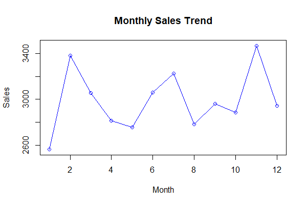

# Homework 3


### Automatic Reports

#### AR: Background

Making reports is an important part of business because they facilitate data-driven decision-making, communication, accountability, and performance evaluation. Automatic reporting is useful because it streamlines the reporting process, reduces errors, provides real-time data, and offers scalability and customization options. In this exercise, you will implement an R Shiny Web App that automatically produces a report based on a file that a user inputs.

#### AR: Specifications

The shiny app has the following specifications.

- For the **user interface**:

  - `fileInput` to let the user upload a file. You can choose whether to restrict to one or multiple file extension.
  - `actionButton` that triggers verification on the file uploaded.
  - `textOutput` that prints the verification.
  - `downloadButton` in order to download a PDF report.

- The **server** comprises three parts:

  - Read the file and save it into a reactive object `data()`.
  - Verification of the file into a `renderText`. At least the type of data must be tested. Depending on your report and the particular application, more tests can be added (number of lines, number of columns, ...).
  - Production of the report into `downloadHandler`. The report is a Rmd file that is rendered within `downloadHandler` with the `rmarkdown::render` command. The format of the report must be PDF.

The report is provided as an additional `.Rmd` file. You can keep it simple, but at the very least, it should use the `data()` input by the user.

#### AR: Exercise

1. Build the shiny app that is described in the Specifications. Before building the Shiny app, we recommend that you look at these two examples:

    - [Download knitr Reports](https://shiny.posit.co/r/gallery/advanced-shiny/download-knitr-reports/),
    - [File Upload](https://shiny.posit.co/r/gallery/widgets/file-upload/).

2. Use the data fetched from **Snipes** as an input for your shiny app and produce a report. You may need to first save the data in the correct format before using it as an input for the shiny app.

---

### Corporate Performance Analysis: An Object-Oriented Approach

#### OOP: Background

In a competitive corporate organisation, sales teams, grouped by their designations, compete fiercely to achieve the highest sales figures. The end of the fiscal year is a crucial time, as sales teams from different designations aim to showcase their prowess and top the charts. Using a data-driven approach, the management wants to evaluate which designation team outperforms others, both in terms of sales figures and customer feedback.

<div style="text-align:center">
    
</div>

#### OOP: Objective

Develop an R-based system using Object-Oriented Programming (OOP) principles to represent, analyse, and visualise the performance metrics of employees by designation. This system will help in understanding both individual employee performance and aggregated metrics for each designation, enabling management to make informed decisions and recognise top performers.

#### OOP: Specifications

##### 1. **Employee Class**

- **Attributes:**
  - `Employee_ID`: A unique identifier. (Type: Non-negative integer)
  - `Name`: Full name of the employee. (Type: Non-empty string)
  - `Department`: Department to which the employee belongs. (Type: Non-empty string)
  - `Designation`: Job title of the employee. (Type: Non-empty string)
  - `Monthly_Sales`: A vector representing sales achieved by the employee for each month. (Type: Non-negative numeric vector)
  - `Monthly_Customer_Feedback_Score`: A vector of feedback scores (out of 10) for each month. (Type: Numeric vector with values between 0 and 10)
- **Methods:**
  - `print()`: This method should display a formatted output of an employee's details and performance metrics.
    - **Output**: A structured, textual representation of the employee's attributes.

    **Example** of `print.Employee`

    ```markdown
    Employee ID: 1 
    Name: Samuel Fischer 
    Department: Sales 
    Designation: Sales Trainee 
    Monthly Sales: 2564, 3383, 3054, 2814, 2755, 3059, 3224, 2783, 2963, 2884, 3468, 2945 
    Monthly Customer Feedback Score: 7.5, 6.7, 7.8, 7.7, 7.5, 8.7, 6.9, 8.1, 8.1, 6.6, 7.4, 8.3
    ```

  - `summary()`: This method should calculate and return an overall performance score based on standardised sales and feedback. It should also provide a brief summary of the employee's yearly performance.
    - **Output**:
      - Average Monthly Sales
      - Average Monthly Customer Feedback Score
      - Total Sales for the Year
      - Overall Performance Score: Calculated as the average of the standardised sales (average sales divided by 500) and the average feedback score. The score can be higher than 10 for exceptional performance.

    **Example** of `summary.Employee`

    ```markdown
    Average Monthly Sales: 2991.33 
    Average Monthly Customer Feedback Score: 7.61 
    Total Sales for the Year: 35896 
    Overall Performance Score: 6.8 
    ```

  - `plot()`: This method should visualise the monthly sales trend of the employee.
    - **Output**: A line plot showing monthly sales on the Y-axis and months on the X-axis. The plot should be appropriately labelled and should highlight the sales trend across months.

    **Example** of `plot.Employee`

    

##### 2. **Designation Class**

- **Attributes:**
  - `Designation_Name`: Name of the designation. (Type: Non-empty string)
  - `List_of_Employees`: A list of objects from the Employee class. (Type: List of Employee objects)
- **Methods:**
  - `print()`: This method should display the designation's name followed by a list of its employees and their details.
    - **Output**:
      - Designation name
      - Number of Employees with the Designation
      - Formatted details of each employee (leveraging the `print.Employee` method).
  - `summary()`: This method should calculate and return metrics related to the department's performance and its top-performing employee.
    - **Output**:
      - Average Monthly Sales for the Designation
      - Average Monthly Customer Feedback Score for the Designation
      - Top Performing Employee's Name
      - Performance Score of the Top-Performing Employee
  - `plot()`: This method should visualise the cumulative monthly sales trend for all employees within the designation.
    - **Output**: A line plot showing cumulative monthly sales for the designation on the Y-axis, and months on the X-axis. The plot should be appropriately labelled, capturing the cumulative sales trend across months.

#### OOP: Tasks

1. **Data Import:** Load the provided dataset `employee_data.csv` into R.
2. **Class Creation:** Implement the `Employee` and `Designation` classes following the specifications mentioned above.
    - While creating the classes, ensure to validate the input data types and constraints as per the specifications.
3. **Data Wrangling:** Convert the long-format dataset into individual `Employee` objects and subsequently into `Designation` objects.
4. **Analysis:**
    - For each designation, invoke the `print` and `summary` methods to understand its performance metrics.
    - Identify the best employee in each designation using the methods in the `Designation` class.
    - For the top employee in each designation, invoke their `print`, `summary`, and `plot` methods to highlight their performance.
