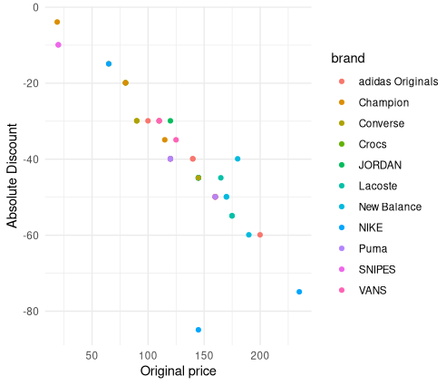

# Homework 3

## Snipes Data Web Scraping and Analysis 🕸️📊

### Introduction 📝

This notebook aims to scrape data from the Snipes website, specifically focusing on discounted shoes. We'll extract key information, create a data frame and visualise the discounts in relation to the original prices.

### Pre-requisites 📦

Load the necessary R packages.

```r
library(rvest)
library(ggplot2)
```

### Legal and Ethical Check 📜

Before proceeding with web scraping, ensure to check the website's robots.txt and terms of service.

```r
# https://www.snipes.ch/robots.txt
# The website's robots.txt does not mention /shoes*
# Terms of Service are not clearly listed
# Thus, web scraping appears to be tolerated
```

### Web Scraping 👨‍💻

#### Fetching Website Data 🌐

Connect to the Snipes website and read the HTML content.

```r
url <- "https://www.snipes.ch/fr/c/shoes?srule=Standard&prefn1=isSale&prefv1=true&openCategory=true&sz=48"
website <- read_html(url) 
```

#### Extracting Product Information 🏷️

We'll extract the following information: product name, brand, original price, and discounted price.

##### Product Name

```r
product <- website %>% html_nodes("span.b-product-tile-link.js-product-tile-link") %>% html_text()
```

##### Brand Name

```r
brand <- website %>% html_nodes("span.b-product-tile-brand") %>% html_text()
brand <- gsub("\n", "", brand) # Remove "\n"
```

##### Original Price

```r
price <- website %>% html_nodes("span.b-product-tile-price-item--line-through") %>% html_text()
price <- gsub("\n", "", price) # Remove "\n"
price <- gsub("CHF ", "", price) # Remove "CHF"
price <- as.double(gsub(",", ".", price)) # Replace "," by "." and coerce to double
```

##### Discounted Price

```r
discount <- website %>% html_nodes("span.b-product-tile-price-outer.b-product-tile-price-outer--line-through+.b-product-tile-price-outer .b-product-tile-price-item") %>% html_text()
discount <- gsub("\n", "", discount) # Remove "\n"
discount <- gsub("CHF ", "", discount) # Remove "CHF"
discount <- as.double(gsub(",", ".", discount)) # Replace "," by "." and coerce to double
```

### Data Aggregation and Analysis 📊

#### Creating Data Frame 📋

Aggregate the scraped data into a data frame, also adding a column for the difference between the original price and discounted price.

```r
snipes <- data.frame(product = product, brand = brand, price = price, discount = discount, difference = discount - price)
```

#### Data Visualisation 📉

Plotting the original price against the discount offered for each brand.

```r
ggplot(snipes, 
       aes(x = price, y = difference, color = brand)) + 
  geom_point() +
  geom_jitter() +
  ylab("Absolute Discount") +
  xlab("Original price") + 
  theme_minimal()
```



#### Save data frame to CSV 📄

Will be helpful for future analysis.

```r
snipes %>% 
    dplyr::select(discount, brand, price) %>% 
    readr::write_csv("data/snipes.csv")
```

---

## File Verification and Report Generation Using Shiny 🌟📑

### Introduction 📝

This notebook outlines how to build a Shiny app to verify CSV files and generate downloadable PDF reports. The app will verify that the uploaded CSV file has exactly 3 columns.

### Pre-requisites 📦

Load the necessary R packages.

```r
library(shiny)
library(readr)
library(rmarkdown)
```

### User Interface (UI) 🖥️

The user interface of our Shiny app comprises a sidebar for file input and verification and a main panel for displaying the verification result and the download button for the report.

```r
ui <- fluidPage(
  titlePanel("File Verification and Report Generator"),
  sidebarLayout(
    sidebarPanel(
      fileInput("file", "Choose a CSV file", multiple = FALSE, accept = ".csv"),
      actionButton("verifyButton", "Verify File")
    ),
    mainPanel(
      textOutput("verificationResult"),
      downloadButton("downloadReport", "Download Report")
    )
  )
)
```

### Server Logic 🖥️⚙️

Here, we define the server logic that dictates how the Shiny app will function.

#### File Reading 📖

This section reads the uploaded CSV file.

```r
data <- reactive({
  inFile <- input$file
  if (is.null(inFile)) return(NULL)
  read.csv(inFile$datapath)
})
```

#### File Verification ✅❌

We verify if the file has exactly 3 columns.

```r
verify_file <- eventReactive(input$verifyButton, {
  if (is.null(data())) {
    return("Please select a CSV file first.")
  }
  if (ncol(data()) == 3) {
    return("File verification successful.")
  } else {
    return("File verification failed. Expected 3 columns.")
  }
})
```

#### Display Results 📋

Display the verification result in the main panel.

```r
output$verificationResult <- renderText({
  verify_file()
})
```

#### Report Generation 📊📑

Generate a downloadable PDF report.

```r
output$downloadReport <- downloadHandler(
  filename = function() 'myreport.pdf',
  
  content = function(file) {
    src <- normalizePath('report.Rmd')
    
    owd <- setwd(tempdir())
    on.exit(setwd(owd))
    file.copy(src, 'report.Rmd', overwrite = TRUE)
    
    out <- render('report.Rmd', output_format = 'pdf_document')
    file.rename(out, file)
  }
)
```

### Run the Shiny App 🚀

Execute the code to run the Shiny app.

```r
shinyApp(ui, server)
```

---

### Corporate Performance Analysis: An Object-Oriented Approach

#### OOP: Background

In a competitive corporate organisation, sales teams, grouped by their designations, compete fiercely to achieve the highest sales figures. The end of the fiscal year is a crucial time, as sales teams from different designations aim to showcase their prowess and top the charts. Using a data-driven approach, the management wants to evaluate which designation team outperforms others, both in terms of sales figures and customer feedback.

<div style="text-align:center">
    
</div>

#### OOP: Objective

Develop an R-based system using Object-Oriented Programming (OOP) principles to represent, analyse, and visualise the performance metrics of employees by designation. This system will help in understanding both individual employee performance and aggregated metrics for each designation, enabling management to make informed decisions and recognise top performers.

#### OOP: Specifications

##### 1. **Employee Class**

- **Attributes:**
  - `Employee_ID`: A unique identifier. (Type: Non-negative integer)
  - `Name`: Full name of the employee. (Type: Non-empty string)
  - `Department`: Department to which the employee belongs. (Type: Non-empty string)
  - `Designation`: Job title of the employee. (Type: Non-empty string)
  - `Monthly_Sales`: A vector representing sales achieved by the employee for each month. (Type: Non-negative numeric vector)
  - `Monthly_Customer_Feedback_Score`: A vector of feedback scores (out of 10) for each month. (Type: Numeric vector with values between 0 and 10)
- **Methods:**
  - `print()`: This method should display a formatted output of an employee's details and performance metrics.
    - **Output**: A structured, textual representation of the employee's attributes.

    **Example** of `print.Employee`

    ```markdown
    Employee ID: 1 
    Name: Samuel Fischer 
    Department: Sales 
    Designation: Sales Trainee 
    Monthly Sales: 2564, 3383, 3054, 2814, 2755, 3059, 3224, 2783, 2963, 2884, 3468, 2945 
    Monthly Customer Feedback Score: 7.5, 6.7, 7.8, 7.7, 7.5, 8.7, 6.9, 8.1, 8.1, 6.6, 7.4, 8.3
    ```

  - `summary()`: This method should calculate and return an overall performance score based on standardised sales and feedback. It should also provide a brief summary of the employee's yearly performance.
    - **Output**:
      - Average Monthly Sales
      - Average Monthly Customer Feedback Score
      - Total Sales for the Year
      - Overall Performance Score: Calculated as the average of the standardised sales (average sales divided by 500) and the average feedback score. The score can be higher than 10 for exceptional performance.

    **Example** of `summary.Employee`

    ```markdown
    Average Monthly Sales: 2991.33 
    Average Monthly Customer Feedback Score: 7.61 
    Total Sales for the Year: 35896 
    Overall Performance Score: 6.8 
    ```

  - `plot()`: This method should visualise the monthly sales trend of the employee.
    - **Output**: A line plot showing monthly sales on the Y-axis and months on the X-axis. The plot should be appropriately labelled and should highlight the sales trend across months.

    **Example** of `plot.Employee`

    

##### 2. **Designation Class**

- **Attributes:**
  - `Designation_Name`: Name of the designation. (Type: Non-empty string)
  - `List_of_Employees`: A list of objects from the Employee class. (Type: List of Employee objects)
- **Methods:**
  - `print()`: This method should display the designation's name followed by a list of its employees and their details.
    - **Output**:
      - Designation name
      - Number of Employees with the Designation
      - Formatted details of each employee (leveraging the `print.Employee` method).
  - `summary()`: This method should calculate and return metrics related to the department's performance and its top-performing employee.
    - **Output**:
      - Average Monthly Sales for the Designation
      - Average Monthly Customer Feedback Score for the Designation
      - Top Performing Employee's Name
      - Performance Score of the Top-Performing Employee
  - `plot()`: This method should visualise the cumulative monthly sales trend for all employees within the designation.
    - **Output**: A line plot showing cumulative monthly sales for the designation on the Y-axis, and months on the X-axis. The plot should be appropriately labelled, capturing the cumulative sales trend across months.

#### OOP: Tasks

1. **Data Import:** Load the provided dataset `employee_data.csv` into R.
2. **Class Creation:** Implement the `Employee` and `Designation` classes following the specifications mentioned above.
    - While creating the classes, ensure to validate the input data types and constraints as per the specifications.
3. **Data Wrangling:** Convert the long-format dataset into individual `Employee` objects and subsequently into `Designation` objects.
4. **Analysis:**
    - For each designation, invoke the `print` and `summary` methods to understand its performance metrics.
    - Identify the best employee in each designation using the methods in the `Designation` class.
    - For the top employee in each designation, invoke their `print`, `summary`, and `plot` methods to highlight their performance.
